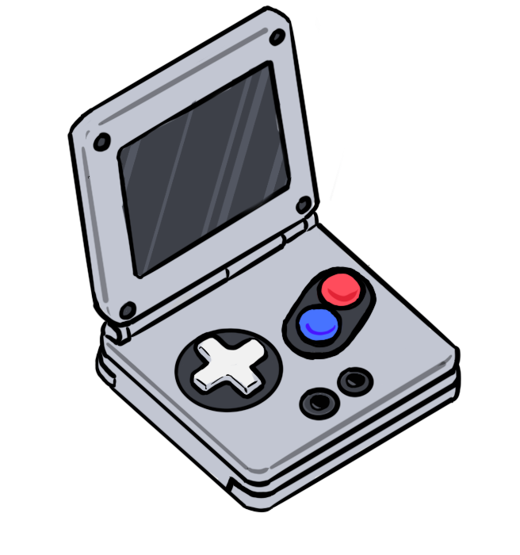
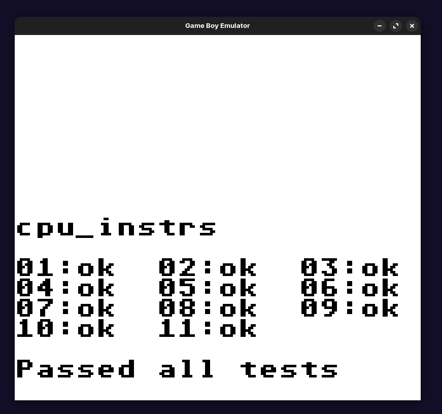
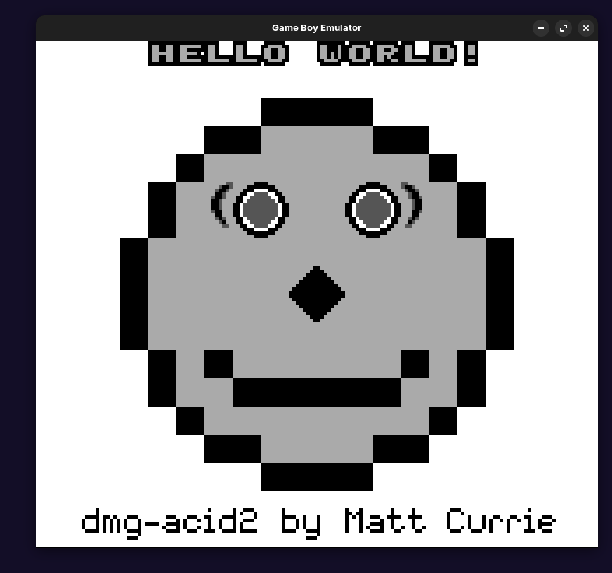
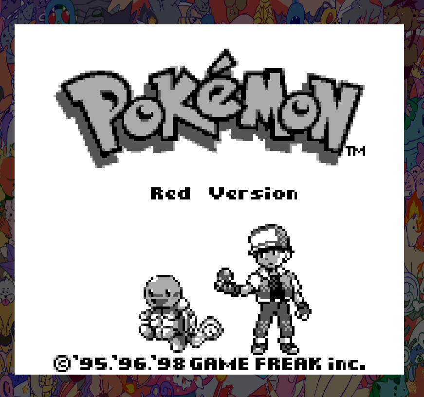
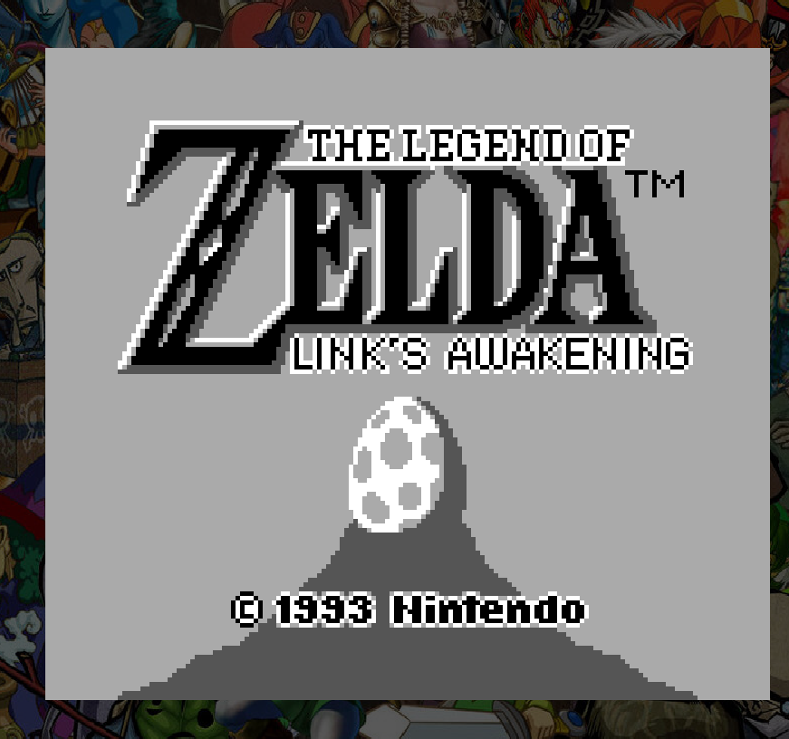

<p align="center">
  
  <span style="font-size:2.5em; font-weight:bold; vertical-align: middle;">EmuBoy - Game Boy Emulator</span>
</p>


# EmuBoy - Game Boy Emulator


**EmuBoy** is a Game Boy emulator written in C++. It aims to provide accurate emulation of the original Nintendo Game Boy hardware, supporting a variety of ROMs and cartridge types, including battery-backed saves.

---

## Features

- **CPU Emulation:** Implements the Game Boy CPU instruction set with a static instruction lookup table for fast decoding.  
<p align="center">
   <br>Passing all of the Blargg Test ROMs:
  <br>
</p>

- **PPU Emulation:** Passes the major PPU hardware tests, including `dmg-acid2`.
<p align="center">
  <br>
</p>

- **Dynamic Background:** Depending on the game, you might see a custom background in fullscreen! :3

<p align="center">
  
  
</p>

- **Memory Banking:** Supports MBC (Memory Bank Controller) logic for ROM and RAM banking (MBC1 and MBC3).
- **Instruction Decoding:** O(1) instruction lookup using a static array.
- **Cartridge Support:** Loads ROMs, parses headers, and supports battery-backed RAM for save games.
- **Save/Load Battery:** Automatically loads and saves battery-backed RAM to disk.
- **Debug Output:** Prints cartridge metadata and checksum validation on load.

---

## Prerequisites

- C++ compiler (tested with g++)
- CMake (build system)
- Make

---

## Automatic installation (recommended):

Run:

```./install.sh```

This script will check for required dependencies (build-essential, cmake, libsdl2-dev, libsdl2-ttf-dev, libsdl2-image-dev).
If dependencies are missing, it will prompt to install them.

This will create a desktop shortcut for the emulator.
Upon clicking on it, you will get to choose the directory in which you have saved your ROMs
You will be prompted to select the ROM and the game will start!

---

## Manual installation:

Install dependencies:

```
sudo apt-get update
sudo apt-get install -y build-essential cmake libsdl2-dev libsdl2-ttf-dev libsdl2-image-dev
```
Run:

```./run.sh```

This will generate the build directory if needed, run CMake, compile the project, and launch the emulator.
You can also launch the emulator from your application menu, thanks to the desktop shortcut created during installation.

### ROMs:

Place your Game Boy .gb ROM files in the roms/ directory.
Battery-backed saves will be stored in the saves/ directory (automatically managed).

---

## Uninstall:
To uninstall the emulator and remove the desktop shortcut:

```./uninstall.sh```

You will be prompted to remove the build directory as well.

---

## License:
This project is for educational purposes.
Please ensure you own the rights to any ROMs you use.

---

## References & Credits
- **Nintendo** – for the original Game Boy hardware and documentation
- [PanDocs](https://gbdev.io/pandocs/About.html) – The ultimate open Game Boy technical reference
- [GBops](https://izik1.github.io/gbops/) – Opcode reference for Game Boy CPU instructions
- [Game Boy Complete Technical Reference (PDF)](https://gekkio.fi/files/gb-docs/gbctr.pdf) – Comprehensive technical manual by Gekkio
- [Low Level Devel](https://www.youtube.com/@lowleveldevel1712) – Video series on Game Boy emulation and low-level development

---

## TODO:
Add audio output
Improve timing accuracy
Add support for more cartridge types and peripherals

---

## Disclaimer:
This emulator is a hobby project, not affiliated with or endorsed by Nintendo, it is open source and licensed under the [MIT License](LICENSE.md).
